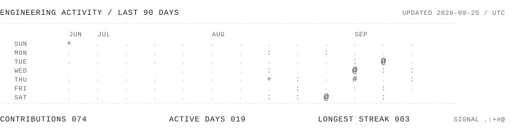

<samp>

LUIS GUSTAVO 
FULL-STACK DEVELOPER / SOFTWARE ENGINEERING STUDENT 
BRAZIL / AVAILABLE FOR NEW PROJECTS 
 
SOFTWARE ACROSS INTERFACES, SYSTEMS AND INFRASTRUCTURE. 
 
---------------------------------------------------------------- 
TECHNICAL FIELD / 01--02 
---------------------------------------------------------------- 
 
I build production web platforms, APIs, computer-vision 
pipelines and native Linux tools. 
 
LANGUAGES&nbsp;&nbsp;&nbsp; TypeScript / Go / Python 
WEB&nbsp;&nbsp;&nbsp;&nbsp;&nbsp;&nbsp;&nbsp;&nbsp;&nbsp; React / Vite / Cloudflare Workers / FastAPI 
SYSTEMS&nbsp;&nbsp;&nbsp;&nbsp;&nbsp; APIs / data / auth / automation / serverless 
ML&nbsp;&nbsp;&nbsp;&nbsp;&nbsp;&nbsp;&nbsp;&nbsp;&nbsp;&nbsp; PyTorch / BioCLIP / computer vision 
NATIVE&nbsp;&nbsp;&nbsp;&nbsp;&nbsp;&nbsp; GTK 4 / Linux / CLI / TUI 
QUALITY&nbsp;&nbsp;&nbsp;&nbsp;&nbsp; Vitest / Playwright / pytest / Ruff / ESLint 
 
---------------------------------------------------------------- 
ACTIVITY SIGNAL / 02--02 
----------------------------------------------------------------

</samp>

<picture>
  <source media="(prefers-color-scheme: dark)" srcset="./assets/activity-dark.svg">
  <source media="(prefers-color-scheme: light)" srcset="./assets/activity-light.svg">
  
</picture>

<samp>

---------------------------------------------------------------- 
<a href="https://rosa-gus.github.io/portfolio/">[PORTFOLIO ->]</a>&nbsp;&nbsp;
<a href="https://github.com/rosa-gus?tab=repositories">[REPOSITORIES ->]</a>&nbsp;&nbsp;
<a href="mailto:rosagus.contato@protonmail.com">[EMAIL ->]</a>

</samp>
